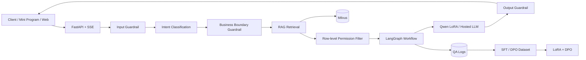

# Architecture

## Runtime Path

## Commercial Modules

- Data: MinerU parser, document normalization, deduplication, chunking, metadata governance.
- Knowledge: embedding service, Milvus vector store, reranker, citation-aware answer builder.
- Agent: LangGraph finite-state workflow for intent, slots, materials, permissions, retrieval, generation, compliance.
- Safety: input interception, domain boundary, output compliance, human handoff, row-level data isolation.
- Model: Qwen LoRA SFT, DPO preference alignment, offline evaluation, canary release.
- Ops: latency, citation coverage, answer acceptance, handoff rate, retrieval hit rate, hallucination sampling.

## Service-Level Targets

- P95 first token latency: less than 500 ms for cached or lightweight retrieval paths.
- Citation coverage: more than 95 percent for policy answers.
- Human handoff: configurable by low confidence, missing citations, or sensitive intent.
- Availability: stateless API instances behind a gateway; Milvus and object storage deployed as managed services in production.

